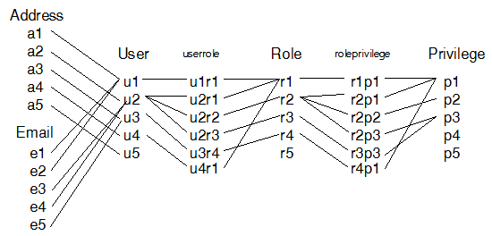
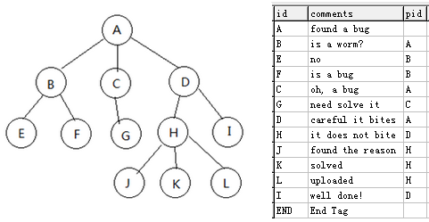

##jSQLBox (In Developing)
**License:** [Apache 2.0](http://www.apache.org/licenses/LICENSE-2.0)  

jSQLBox is a micro scale persistence tool for Java.

Other persistence tools' problem:  
Hibernate: It's a ORM tool, too complicated, the XML or Annotation configurations are fixed, fields definations, "One to Many", "Many to One" relationships are fixed, hard to create/modify/re-use configuations at runtime. For example, can not temporally change configuration at runtime to exclude some fields to avoid lazy loading.  
Other DB tools: Have no a balance between powerfulness and simpliness.  

Feature of jSQLBox:  
1) Simple, very few source code, No XML, easy to learn and use.   
2) The Java-Based Bean configuration can be created/modified dynamically at runtime(similar like jBeanBox project).  
3) The configuration and Bean classes can be created by source code generation tool because it's a simple map of database.  
4) jSQLBox is based on Active Record design mode but entity class only need implements Entity interface(For Java8).  
5) There are simple "one to one", "one to many", "tree" ORM functions in jSQLBox.    
6) jSQLBox offers basic CURD methods, but encourage mixed use with raw SQL, it's safe to mix use CRUD methods and sql.  
7) jSQLBox support H2,MySql,MSSQL,Oracle and will support more.
8) To make it simple, jSQLBox project only focus on basic CRUD method + SQL + Simple ORM, do not offer complex functions like lazy load.  
 
###How to use jSQLBox? 
Add below configuration in pom.xml:
```
<dependency>
    <groupId>com.github.drinkjava2</groupId>
    <artifactId>jsqlbox</artifactId>
    <version>1.0.0-SNAPSHOT</version>
</dependency>
```
Note: if already used other Spring version in project, need put below lines to force jSqlBox use existed Spring version:
```
    <exclusions>
        <exclusion>
            <groupId>org.springframework</groupId>
            <artifactId>spring-context</artifactId>
            </exclusion>
        <exclusion>
            <groupId>org.springframework</groupId>
            <artifactId>spring-jdbc</artifactId>
            </exclusion>
        </exclusions>
    </dependency>
```

### How to import jSQLBox project into Eclipse(for developer)?  
1)Install JDK8+、 Git bash、 Maven, run：  
2)git clone https://github.com/drinkjava2/jSqlBox  
3)cd jsqlbox  
4)mvn eclipse:eclipse  
5)Open Eclipse, "import"->"Existing Projects into Workspace", select jsqlbox folder   

jSqlBox Examples：
---
Example 1 - First jSqlBox program
```
	public static void main(String[] args) {
		ComboPooledDataSource ds = new ComboPooledDataSource();//c3p0 pool
		ds.setUser("root");
		ds.setPassword("root888");
		ds.setJdbcUrl("jdbc:mysql://127.0.0.1:3306/test?rewriteBatchedStatements=true&useSSL=false");
		ds.setDriverClass("com.mysql.jdbc.Driver"); 
		
        //SqlBoxContext equal to Hibernate's SessionFactory
		SqlBoxContext ctx = new SqlBoxContext(ds);
		User u = ctx.create(User.class); //Map User to USERS or USER database table, only allow find 1
		u.setUserName("User1"); //map field to USERNAME or USER_NAME, only allow find 1
		u.setAddress("Address1");  
		u.insert(); 
	} 
```

Example 2 - User Spring or jBeanBox like IOC tool inject SqlBoxContext, for jBeanBox project see https://github.com/drinkjava2/jBeanBox
```
	public static void main(String[] args) {
		SqlBoxContext ctx = BeanBox.getBean(CtxBox.class);//inject by IOC tool
		User u = ctx.create(User.class);
		u.setUserName("User1");
		u.insert(); 	 
	} 
```

Example 3 - User default SqlBoxContext
```
	//When system start up
 	SqlBoxContext.setDefaultSqlBoxContext(BeanBox.getBean(DefaultSqlBoxContextBox.class));
	
	public static void main(String[] args) {
		User u = new user();//Here use default SqlBoxContext
		u.setUserName("User1");
		u.setAddress("Address1");
		u.insert(); 	 
	} 
```
		
Example 4 - Dynamic configuration
```
		Customer c = new Customer().configAlias("c"); //SQL alias "c"
		c.box().setContext(ctx2);//SqlBoxContext set to ctx2
		c.box().configTable("customer2"); //map to database table "customer2"
		c.box().configColumnName("customerName","cname2");//map field customerName to column "cname2"
		c.box().configMapping(oneToMany(), c.ID(), a.CID(), bind());//add a orm mapping
		c.setCustomerName('Zhang shang');
		...	
```		
Example 5 - Write parameters directly in SQL, parameters stored in Threadlocal中, SQL will transfer to preparedStatement
```
    Dao.execute("update users set", //  
            " username=?", empty("Peter"), //  
            ",address=? ", empty("Nanjing"), //  
            " where age=?", empty(40));  
    Dao.execute("update users set", //  
            " username=", q("Jeffery"), //  
            ",address=", q("Tianjing"), //  
            " where age=", q(50));  
    Dao.execute("insert into users ", //  
            " (username", empty("Andy"), //  
            ", address", empty("Guanzhou"), //  
            ", age)", empty("60"), //  
             SqlHelper.questionMarks());  
```

Example 6 - Batch insert 100000 lines, cost ~5s, same, SQL will transfer to preparedStatement
```
    public void tx_batchInsertDemo() {  
        for (int i = 6; i < 100000; i++)  
            Dao.cacheSQL("insert user (username,age) values(",q("user"+i)+",",q(60),")");  
        Dao.executeCatchedSQLs();  
    }  
```

Example 7 - A condition query example, no need worry about Sql Inject issue
```
	public int conditionQuery(int condition, Object parameter) {
		User u = new User();
		String sql = "Select count(*) from " + u.table() + " where ";
		if (condition == 1 || condition == 3)
			sql = sql + u.USERNAME() + "=" + q(parameter) + " and " + u.ADDRESS() + "=" + q("Address1");
		if (condition == 2)
			sql = sql + u.USERNAME() + "=" + q(parameter);
		if (condition == 3)
			sql = sql + " or " + u.AGE() + "=" + q(parameter);
		return Dao.queryForInteger(sql);
	}  
```

Example 8 - Transaction, directly use Spring's declarative transaction, detail see test\function_test\transaction
```
	@AopAround(SpringTxInterceptorBox.class) //wrapped in transaction
	public void insertUser() {
		User u = new User(); 
		u.setUserName("User2");
		u.setAddress("Address2");		 
		u.setAlive(true); 
		u.insert(); 
	} 

	public static void main(String[] args) {
		InsertTest t = BeanBox.getBean(InsertTest.class); //get proxy instance
		t.insertUser();  
	}

```

Example 9 Entity classes only need implements Entity interface (For Java 8+)
```
public class User implements Entity{ 
	private Integer id;//Named "id" means it's Entity ID
	private String userName;
	private String phoneNumber;
	private String address;
	private Integer age;
	private Boolean active;
	//Getter & Setter 

	{
	//this.box().configEntityIDs("id"); //"id" is already Entity ID
	//configEntityIDs support multiple parameters(fields)
	this.box.configIdGenerator("id", BeanBox.getBean(UUIDGenerator.class));//ID is UUID type
	}
	
	//Below methods are not compulsory
	public String ID() {
		return box().getColumnName("id");
	}

	public String USERNAME() {
		return box().getColumnName("userName");
	}

	public String PHONENUMBER() {
		return box().getColumnName("phoneNumber");
	}

	public String ADDRESS() {
		return box().getColumnName("address");
	}

	public String AGE() {
		return box().getColumnName("age");
	}

	public String ACTIVE() {
		return box().getColumnName("active");
	}
}
```
jSqlBox currenlty has 9 different P-Key generation methods.   

Example 10 - Box configuration: 
put a UserBox class under or in User.class to configurate it. 
```
public class UserBox extends SqlBox {
	{
		this.setBeanClass(User2.class);
		this.configTableName("usertable2");
		this.configColumnName(User.UserName, "User_Name2");
		this.configColumnName(User.Address, "Address2");
		this.configColumnName(User.PhoneNumber, "Phone2");
	}
}
```
or get the configuation instance by call this.box() method in class initialization block. 

Example 11 - One to One mapping  
```
        User u = new User();  
        Address a = new Address();  
        List<User> users = Dao.queryForEntityList(User.class, select(), u.all(), ",", a.all(), from(), u.table(), ",",  
                a.table(), " where ", oneToOne(), u.ID(), "=", a.UID(), bind());  
        for (User user : users) {   
            Address address = user.getChildNode(Address.class);   
            User user2 = address.getParentNode(User.class);  
            Assert.assertTrue(user == user2);  //true
        }  
```
all() means return all fields in SQL  

Example 12 - One to Many mapping:
```
		User u = new User();
		Email e = new Email();
		List<User> users = Dao.queryForEntityList(User.class, select(), u.all(), ",", e.all(), from(), u.table(), ",",
				e.table(), " where ", oneToMany(), u.ID(), "=", e.UID(), bind(u.EMAILS(), e.USER()));
		for (User user : users) {
			Set<Email> emails = user.getEmails();
			for (Email email : emails) 
				Assert.assertTrue(email.getUser() == user);
		}
```

Example 13 - Many to Many mapping:
```
		User u = new User();
		Role r = new Role();
		Privilege p = new Privilege();
		UserRole ur = new UserRole();
		RolePrivilege rp = new RolePrivilege();
		Dao.getDefaultContext().setShowSql(true);
		List<User> users = Dao.queryForEntityList(User.class,
				u.pagination(1, 10, //
						select(), u.all(), ",", ur.all(), ",", r.all(), ",", rp.all(), ",", p.all(), from(), u.table(), //
						" left join ", ur.table(), " on ", oneToMany(), u.ID(), "=", ur.UID(), bind(), //
						" left join ", r.table(), " on ", oneToMany(), r.ID(), "=", ur.RID(), bind(), //
						" left join ", rp.table(), " on ", oneToMany(), r.ID(), "=", rp.RID(), bind(), //
						" left join ", p.table(), " on ", oneToMany(), p.ID(), "=", rp.PID(), bind(), //
						" order by ", u.ID(), ",", r.ID(), ",", p.ID()));
		for (User user : users) {
			System.out.println(user.getUserName());
			Set<Role> roles = user.getUniqueNodeSet(Role.class);
			for (Role role : roles)
				System.out.println("\t" + role.getRoleName());//user's role
			Set<Privilege> privs = user.getUniqueNodeSet(Privilege.class);
			for (Privilege priv : privs)
				System.out.println("\t" + priv.getPrivilegeName());//user's privilege
		}
```
use 2 one to many mapping to implement many to many mapping. Dao.pagination() and Dao.orderBy() methods used to implement general pagination.

Example11 to Example13 object pictures：  
 
Example 14 - tree mapping
```
		TreeNode t = new TreeNode().configAlias("t");
		t.configMapping(tree(), use(t.ID(), t.PID()), bind(t.CHILDS(), t.PARENT()));
		List<TreeNode> childNodes = Dao.queryForEntityList(TreeNode.class, select(), t.all(), from(), t.table(),
				" where level>0 order by ", t.LINE());
		TreeNode root = childNodes.get(0);
		printBindedChildNode(root);	 	//print tree nodes	
		
```
About tree mapping, please see http://drinkjava2.iteye.com/blog/2353983。
picture： 

Below example show move "D" tree to under "C", then use a SQL to query and get the whole node tree, detail see test class TreeORMTest.java.
```
		TreeNode d = Dao.load(TreeNode.class, "D");
		d.setPid("C");//Move D to C
		d.update(); //Save 
		sortMySqlTree(); //Transfer Adjacency List to Sorted-Unlimited-Depth-Tree

		TreeNode c = Dao.load(TreeNode.class, "C");
		c.configAlias("c");
		c.configMapping(tree(), use(c.ID(), c.PID()), bind());
		List<TreeNode> c_childtree = loadChildTree(c);
		TreeNode croot = c_childtree.get(0);
		Assert.assertEquals("C", croot.getId());
		printUnbindedChildNode(croot);//print tree nodes
		
		private List<TreeNode> loadChildTree(TreeNode n) {//Query tree by 1 SQL
		List<TreeNode> childtree = Dao.queryForEntityList(TreeNode.class, select(), n.all(), from(), n.table(),
				" where line>=" + n.getLine() + " and line< (select min(line) from ", n.table(), " where line>",
				q(n.getLine()), " and level<= ", q(n.getLevel()), ") order by ", n.LINE());
		return childtree;
		}
```

Example 15 - L1, L2 Cache(In developing) 
 
	 