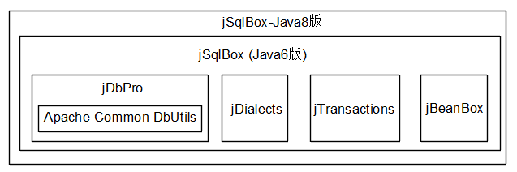

<p align="center">
  <a href="https://github.com/drinkjava2/jSqlBox">
   
  </a>
</p>

<p align="center">
  基于DbUtils的全功能数据库持久层工具
</p>

<p align="center">
  <a href="http://search.maven.org/#search%7Cga%7C1%7Cg%3A%22com.github.drinkjava2%22%20AND%20a%3A%22jsqlbox%22">
    
  </a>

  <a href="https://www.apache.org/licenses/LICENSE-2.0">
    
  </a>
</p>

# 简介 | Intro

jSqlBox是一个基于DbUtils内核开发的跨数据库、提供多种SQL写法、ActiveRecord、ORM查询、主从及分库分表、声明式事务等功能的数据库持久层工具。简单地说，是一个全功能数据库持久层工具。  
jSqlBox有Java6和Java8两个版本。

# 架构 | Architecture  
  

# 优点 | Advantages

- **架构优良**：模块式架构，各个模块都可以脱离jSqlBox单独存在。
- **跨数据库**：基于jDialects，支持70多种数据库的分页、函数变换，是Hibernate之外少有的支持跨数据库DDL生成的工具。
- **尺寸小**： 仅有jSqlBox和DbUtils两个依赖包,合计约500k大小。
- **与DbUtils兼容**：继承于DbUtils, 原有基于DbUtils的项目可以无缝升级到jSqlBox。
- **多种SQL写法**：Inline方法、模板方法、DataMapper、ActiveRecord、链式写法等。
- **多项技术创新**：Inline风格、多行文本支持、实体越级关联查询、树结构查询等。
- **动态配置**：除了支持实体Bean注解式配置，jSqlBox还支持在运行期动态更改配置。
- **无会话设计**：无会话设计(Sessionless)，是一个真正轻量级的、全功能的持久层工具，也可以作为其它持久层工具的补丁来使用。
- **自带声明式事务**：基于独立小巧的声明式事务工具jTransactions。也支持配置成Spring事务。
- **学习曲线平滑**：模块化学习，了解了各个子模块，就掌握了jSqlBox，jSqlBox主体只有30多个类。

# 文档 | Documentation

[中文](https://gitee.com/drinkjava2/jSqlBox/wikis/pages)  |  [English](https://github.com/drinkjava2/jSqlBox/wiki) | [JavaDoc](http://search.maven.org/#search%7Cga%7C1%7Ca%3A%22jsqlbox%22)

# 应用示例 | Demo

* [jBooox](https://gitee.com/drinkjava2/jBooox) 这是一个微型MVC Web项目，基于三个开源软件jBeanBox、jSqlBox、jWebBox的整合，需发布到Tomcat下运行。
* [jsqlbox-beetlsql](../../tree/master/demo/jsqlbox-beetlsql) 演示如何在jSqlBox中开发和使用其它模板引擎如BeetlSQL。
* [jsqlbox-in-actframework](../../tree/master/demo/jsqlbox-in-actframework) 演示jSqlBox与ActFramework框架的整合，用jSqlBox替换掉其自带的EBean持久层工具，并利用Guice的AOP和TinyTx实现声明式事务。
* [jsqlbox-in-jfinal](../../tree/master/demo/jsqlbox-in-jfinal) 演示jSqlBox与jFinal的整合，用jSqlBox替换掉jFinal自带的DAO工具, 并利用jFinal自带的AOP和声明式事务功能。
* [jSqlBox-in-Spring](../../tree/master/demo/jsqlbox-in-spring) 这是一个MVC Web项目，演示jSqlBox在Spring+Tomcat环境下的配置和使用, IOC、AOP和声明式事务均使用Spring的。
* [jsqlbox-in-springboot](../../tree/master/demo/jsqlbox-in-springboot) 演示jSqlBox在SpringBoot环境下的配置和使用, IOC/AOP和声明式事务均使用SpringBoot的。
* [jsqlbox-in-springboot-mybatis](../../tree/master/demo/jsqlbox-in-springboot-mybatis) 演示jSqlBox在SpringBoot环境下和MyBatis的混用，IOC、AOP和声明式事务均使用SpringBoot的。
* [jsqlbox-java8-demo](../../tree/master/demo/jsqlbox-java8-demo) 演示jSqlBox-Java8版的使用，主要有利用Lambda语法来写SQL、ActiveEntity的演示。
* [jsqlbox-xa-atomikos](../../tree/master/demo/jsqlbox-xa-atomikos) 演示了jSqlBox的分库分表在分布式事务环境下的使用，使用Atomikos作为分布式事务管理器。


# 下载地址 | Download

[点此去下载](http://search.maven.org/#search%7Cga%7C1%7Ca%3A%22jsqlbox%22)   

或在pom.xml中加入：

```xml
<dependency>
   <groupId>com.github.drinkjava2</groupId>
   <artifactId>jsqlbox</artifactId> <!--用于Java6、7环境-->
   <version>2.0.3</version>
</dependency> 
```
或
```xml
<dependency>
   <groupId>com.github.drinkjava2</groupId>
   <artifactId>jsqlbox-java8</artifactId> <!--Java8环境-->
   <version>2.0.3</version>
</dependency> 
```

# 作者其它开源项目 | Other Projects

- [一个独立的数据库方言工具（含DDL、分页等) jDialects](https://gitee.com/drinkjava2/jdialects)
- [一个独立的声明式事务工具 jTransactions](https://gitee.com/drinkjava2/jTransactions)
- [一个小巧的全功能IOC/AOP工具 jBeanBox](https://gitee.com/drinkjava2/jBeanBox)
- [一个500行源码的服务端布局工具 jWebBox](https://gitee.com/drinkjava2/jWebBox)
- [一个以“造人”为目标的人工智能实验项目 人工生命](https://gitee.com/drinkjava2/frog)

# 期望 | Futures

欢迎发issue提出更好的意见或提交PR，帮助完善jSqlBox

# 版权 | License

[Apache 2.0](http://www.apache.org/licenses/LICENSE-2.0)

# 关注我 | About Me
[Github](https://github.com/drinkjava2)  
[码云](https://gitee.com/drinkjava2)  
